# 👋 Hey, I'm Salaheddine KAYOUH

🚀 **AI Engineer | Generative AI • MLOps • Web3 AI Architect**  
🎓 **Final-Year Data & AI Engineering Student – ENSA**  
📍 **Morocco | Open to Relocation & Remote Opportunities**

 

<!-- ═══════════════════════════════════════════════════════════════════════════ -->
<!-- 📊 PROFILE BADGES                                                           -->
<!-- ═══════════════════════════════════════════════════════════════════════════ -->

  
  &nbsp;
  
  &nbsp;
  
  &nbsp;
  

 

 

<!-- ═══════════════════════════════════════════════════════════════════════════ -->
<!-- 🖥️ TERMINAL INTRO SECTION                                                   -->
<!-- ═══════════════════════════════════════════════════════════════════════════ -->

  

 

 

I design and build **production-grade AI systems** that bridge:

- 🤖 **Generative AI:** LLMs, RAG systems, AI agents  
- ⚙️ **Scalable Data Pipelines & MLOps**  
- 🔗 **Web3 & Intelligent Asset Management**

Currently working as an **AI & Blockchain Engineer at IZEMX**, architecting an **AI-powered Web3 investment platform** for tokenized asset management.  
I enjoy transforming complex business needs into **AI-ready architectures, scalable pipelines, and deployable systems**.

<!-- ═══════════════════════════════════════════════════════════════════════════ -->
<!-- 🏆 ACHIEVEMENTS SECTION                                                     -->
<!-- ═══════════════════════════════════════════════════════════════════════════ -->

  

  
  <!-- GitHub Trophies -->
  
  

 

<!-- ═══════════════════════════════════════════════════════════════════════════ -->
<!-- 📊 GITHUB ANALYTICS                                                         -->
<!-- ═══════════════════════════════════════════════════════════════════════════ -->

  

  
  <!-- GitHub Stats + Custom Streak in ONE ROW -->
  
  &nbsp;
  
  
    
  
  <!-- 📊 REAL-TIME LANGUAGE USAGE WITH PROGRESS BARS -->
  
  
    
  
  <!-- Activity Graph -->
  
  
    
  
  <!-- Additional Stats Cards -->
  
  

 

 

## 🎯 What I’m Focused On (2025–2026)

- 🧠 **Advanced RAG architectures & multi-agent orchestration**  
- 📊 **AI-driven risk profiling & predictive scoring systems**  
- 🔗 **AI × Blockchain integration** (tokenization, smart automation)  
- ⚙️ **MLOps, CI/CD, observability & production deployment**  
- 🏗️ **Designing AI-native product architectures**

 

## 💼 Professional Experience

### 🔗 AI & Blockchain Engineer — IZEMX  
📅 *02/2026 – Present*

- Contributing to the architecture of an **AI-powered Web3 investment platform**
- Designing **AI-driven onboarding & intelligent risk profiling systems**
- Translating business logic into **structured AI-ready documentation**
- Defining **functional specifications (SFG)** for core modules
- Integrating **AI use cases** into the MVP roadmap (automation, scoring, prediction)
- Participating in **blockchain infrastructure & smart contract** discussions
- Working in an **Agile environment** (Jira-based workflow)

### 🤖 AI Automation Engineer (R&D) — ENSATE  
📅 *06/2025 – 08/2025*

- Architected **SmartENSATE**, a multi-agent orchestration system using n8n & Python
- Engineered a **biometric verification module** (Face++ API integration)
- Built a **RAG-based support chatbot** (LangChain + OpenAI + PostgreSQL vector store)
- Automated exam workflows → reduced theoretical processing time by **80%**
- Designed **scalable automation pipelines** for high-volume administrative flows

 

## 🚀 Featured Projects

### 📊 Crypto Sentiment Analysis System *(Project Lead)*

- Led a team of **8 data scientists**
- Processed **10,000+ crypto posts** (Reddit APIs + FinBERT)
- Achieved **75%+ classification accuracy**
- Identified **0.65 correlation** between sentiment & price movement
- Managed the **Agile lifecycle** (4 specialized squads)
- **Stack:** Python, Transformers, spaCy, Streamlit, GitHub Projects

### 🔗 Decentralized Delivery Platform *(Smart Contracts)*

- Developed **Solidity contracts** on Polygon (escrow + split logic)
- Reduced settlement time by **85%**
- Integrated **Chainlink Oracles** (dynamic pricing)
- Built a **hybrid ETL pipeline** syncing blockchain → MongoDB
- Secured transactions with **IPFS cryptographic proofs**
- **Stack:** Solidity, Polygon, Chainlink, Node.js, MongoDB, IPFS

 
## 🧠 Technical Skills & Technologies

### 💻 Programming & Frameworks
| Category | Technologies |
|-----------|---------------|
| **Languages** |     |
| **Backend** |    |
| **Frontend** |    |

 

### 🤖 Data Science, AI & Machine Learning
| Category | Technologies |
|-----------|---------------|
| **Frameworks** |     |
| **Generative AI** |    |
| **Experimentation** |   |

 

### 📊 Data Engineering & Big Data
| Category | Technologies |
|-----------|---------------|
| **ETL & Processing** |    |
| **Cloud & Storage** |    |
| **Streaming & Caching** |   |

 

### 🗄️ Databases & Vector Stores
| Category | Technologies |
|-----------|---------------|
| **Relational DBs** |   |
| **NoSQL & Caching** |   |
| **Vector Databases** |   |

 

### ☁️ Cloud, DevOps & Deployment
| Category | Technologies |
|-----------|---------------|
| **Infrastructure** |    |
| **CI/CD & Versioning** |   |
| **Monitoring & Logging** |    |

 

### 📈 Data Visualization & BI
| Tools | Icons |
|--------|--------|
| **Power BI** |  |
| **Tableau** |  |
| **Plotly / Dash** |  |
| **Matplotlib / Seaborn** |   |

 

### 🧩 Methodologies & Soft Skills
- **Project Management:** Agile / Scrum, Jira, Trello  
- **Documentation:** Notion, Confluence, Markdown  
- **Soft Skills:** Analytical mindset, teamwork, curiosity, leadership  
- **Languages:** Arabic (Native) | French (Fluent) | English (Fluent)

 

## 🏆 Certifications

- 🎓 **Data Analysis and Visualization with Power BI (Microsoft)**  
- 🧠 **Data Engineer Associate certificate (DataCamp)**  

 

## 🌍 Extracurricular Activities

-  **Treasurer – AI Geeks Club (ENSATE) :** Budget management, tech event coordination, and partner relations. 
-  **Chief of Protocol – Rotaract (ENSATE)** : Ensuring compliance with Rotaract standards and protocol during official events.
-  **Participation in organizing the 2025 Forum – ADE (ENSATE)** : Company and sponsor outreach and followup.

 

  
  

 

### 💡 Fun Fact  
*"I’m currently building my own digital business while teaching myself advanced AI engineering on the side."*

 

