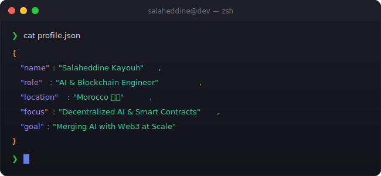

 

<!-- ═══════════════════════════════════════════════════════════════════════════ -->
<!-- 📊 PROFILE BADGES                                                           -->
<!-- ═══════════════════════════════════════════════════════════════════════════ -->

  
  &nbsp;
  
  &nbsp;
  
  &nbsp;
  

 

 

<!-- ═══════════════════════════════════════════════════════════════════════════ -->
<!-- 🖥️ TERMINAL INTRO SECTION                                                   -->
<!-- ═══════════════════════════════════════════════════════════════════════════ -->

  

 

 

I design and build **production-grade AI systems** that bridge:

- 🤖 **Generative AI:** LLMs, RAG systems, AI agents  
- ⚙️ **Scalable Data Pipelines & MLOps**  
- 🔗 **Web3 & Intelligent Asset Management**

Currently working as an **AI & Blockchain Engineer at IZEMX**, architecting an **AI-powered Web3 investment platform** for tokenized asset management.  
I enjoy transforming complex business needs into **AI-ready architectures, scalable pipelines, and deployable systems**.

<!-- ═══════════════════════════════════════════════════════════════════════════ -->
<!-- 🏆 ACHIEVEMENTS SECTION                                                     -->
<!-- ═══════════════════════════════════════════════════════════════════════════ -->

  

  
  <!-- GitHub Trophies -->
  
  

 

<!-- ═══════════════════════════════════════════════════════════════════════════ -->
<!-- 📊 GITHUB ANALYTICS                                                         -->
<!-- ═══════════════════════════════════════════════════════════════════════════ -->

  

  
  <!-- GitHub Stats + Custom Streak in ONE ROW -->
  
  &nbsp;
  
  
    
  
  <!-- 📊 REAL-TIME LANGUAGE USAGE WITH PROGRESS BARS -->
  
  
    
  
  <!-- Activity Graph -->
  
  
    
  
  <!-- Additional Stats Cards -->
  
  

 

 

  
  

 

### 💡 Fun Fact  
*"I’m currently building my own digital business while teaching myself advanced AI engineering on the side."*

 

